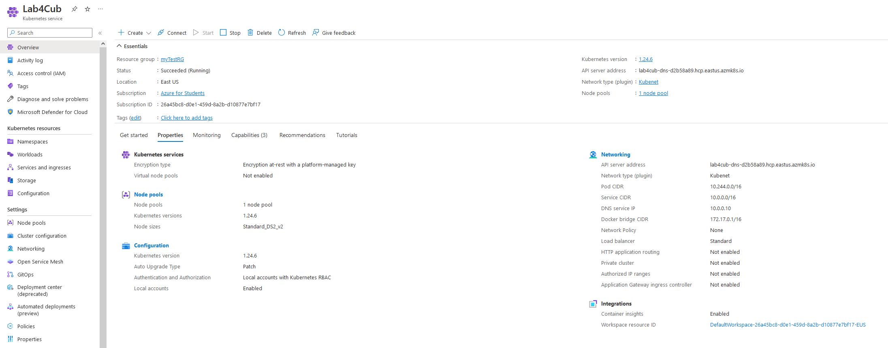

# Lab4

Aufgabenstellung:

- Aufestezen und Konfiguration eines AKS in Azure

- Konfiguration und deplyoment von Wordpress incl. MySQL in dem AKS cluster. 


## Creating the AKS cluster

I finished this Lab by using this [tutorial](https://learn.microsoft.com/en-us/azure/aks/tutorial-kubernetes-prepare-app). With this as a guide it was fairly easy to set up the AKS cluster. I opted for the cheapest offer available under the Dev/Test peset of kubernetes. 

The created AKS cluster on Azure:



After this was set up and deployed I set up a kustomization.yaml according to the guide. 

Then I created the deplyment files for Wordpress and MySQL which containes references to the storage volume for both services.

Then the final step was to deply to the cluster by using this command:

```
kubectl apply -k ./
```

After this had finished deploying I checked if the deployment was successful by using the following command:

```
kubectl get [secrets/pods/pvc/...]
```

I used this [guide](https://kubernetes.io/docs/tutorials/stateful-application/mysql-wordpress-persistent-volume/) for creataing certain files in addition to the guide mentioned above.

## Cluster URL
The cluster url is:
```
https://lab4cub-dns-d2b58a89.hcp.eastus.azmk8s.io:443
```
